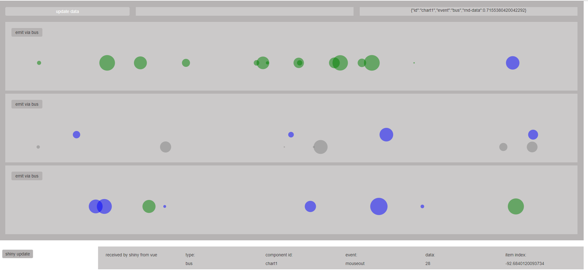

# creating vue components with d3 and shiny

## Introduction

D3 stands for `Data Driven Documents`. D3 can be used to create any chart imaginable using web standards only. For some examples, see Mike Bostock's [bl.ock](https://bl.ocks.org/mbostock) collection and the official [docs](https://d3js.org/).

The power of `d3` comes from its ability to bind data to the DOM and for being an incredibly powerful toolbelt library that serves as a visualization kernel. On the other hand, [Vue](https://vuejs.org/) is a popular progressive framework for building user interfaces that is both easy to use and incrementally adoptable.

In addition, vue offers a powerful template and rendering framework that let's us compose applications as a set of reusable `components`, combined with a powerful `reactive` event system.

These days every major application framework offers bindings to Javascript. Hence, it makes sense to combine the power of `vue` and `d3` to _create reactive data driven visualization components_ based on modern javascript i.e. [ES6](https://babeljs.io/docs/en/learn/).

As these components are completely Javascript based, they can be used inside `.NET`, `Python` and `R/Shiny` applications, without modifying any code. In that sense, our goal here is not to create an R `HTMLWidget`, but to create Javascript code that can be copied (almost) verbatim, while still working in other environments that support Javascript.

This text discusses the details of a technical prototype that involves in a number of custom `d3` driven bubble chart `components`, together with a `main vue app` and a `reactive event system` that let's components communicate with each other, with the main vue app and even with R/Shiny. The goals is to stay close to Javascript while still being able to use most of the code in a shiny app.

#### additional links

For more information on R based web applications and widgets, see [shiny](https://shiny.rstudio.com/) and [HTMLWidgets](https://www.htmlwidgets.org/), respectively. For a collection of my personal bl.ocks, see [here](http://blockbuilder.org/search#user%3Dfrissanalytics). For convenience, we also use a small set of functions from [Lodash](https://lodash.com/docs/4.17.10), another very useful toolbelt library.

#### application overview

Our shiny toy app looks like this:



Our toy app has three parts: a top section showing hover event info, a mid section with 3 vue components and a lower section that shows events that shiny received from the vue components. The top two sections represent our main vue instance that holds 3 child components i.e. our bubble charts.

Each bubble plot is a `d3` based `vue component` that shows a number of circles as it's data, using a `d3` scale to position them on an x-axis. The data for each chart is a simple array, containing numbers drawn from a normal distribution. On a key press we can generate new data for each chart, drawing a _dynamic_ number of data points from a set of normal distributions.

The data itself has no meaning, other than allowing us to draw some circles with them. At each generation, the circle radii are animated to a random radius, just for fun. As the number of data points on each generation is dynamic, we can apply the `d3` _enter, update, exit pattern_ to our charts. In our case, the enter selection is green, the update selection is blue and the exit selection is gray.

#### key functionality

This toy application demonstrates a number of concepts:

1.  show how to encapsulate complex `d3` logic in a vue component
2.  automatically resize components based on the parent container dimensions
3.  make components react to data changes (props) send down from the parent (the main app) to the child components (the bubble components)
4.  let components emit events to their parent based on `hover` and `click` events
5.  as an alternative, use a global `event bus` to emit events, regardless if there is a child parent relationship
6.  use the same components in both a vanilla Javascript context _and_ an R / shiny context, _without_ changing a single line of code inside the components
7.  show how to update components from _R_
8.  show how to send events from Javascript to _R_

### main vue instance

The main vue instance, has an id of `app` and holds 3 bubble chart instances. On the HTML side of things, the main vue app looks like this:

```html
<div id="app" ref="app">

    ...

    <bubble-chart ...></bubble-chart>
    <bubble-chart ...></bubble-chart>
    <bubble-chart ...></bubble-chart>

</div>
```

The 3 bubble chart instances are created via custom `<bubble-chart></bubble-chart>` tags, which represent vue components.

During the lifetime of the vue instances, the markup will be replaced with actual DOM nodes that make up the charts. Some of these nodes are created and controlled by `vue`, while others are created and controlled by `d3` (more on this below).

On the Javascript side of things, we first define a main vue app:

```Javascript
var app = new Vue({

   el: "#app",

   data: {
        width: 960,
        height: 500,
        timeline_data1: [-300, 300],
        timeline_data2: [-300, 300],
        timeline_data3: [-300, 300],
        hover_payload: null
    },

    methods: {

        ...
    },

    ..
})
```

We'll explain the details and other parts of the main vue instance below.

### vue components

In addition to our main vue app, we also define a bubble chart component as follows:

```Javascript
 Vue.component("bubble-chart", {

    props: ["id", "width", "height", "data"],

    ...

    methods: {
        ...
    },

    ...

    template: `
        <div class = "custom">
            ...
            <svg :id="id" width="100%" :height="height" ref="svg"></svg>
        </div>`
})
```

Among other things discussed below, the components involves a `template` declaration, that asks vue to render a `div` with an `svg` nested inside it. During the lifetime of the `vue` component, the template is rendered to the DOM. At a later stage in the lifetime of our instance, we'll use `d3` to inject additional content into our `svg`. The outer `div` sets a CSS class that creates some additional room and styles for our chart instance:

```css
#app {
  width: 100%;
  padding: 10px;
  background-color: rgba(180, 177, 177, 0.973);
  box-sizing: border-box;
}

.custom {
  margin: 10px;
  padding: 10px;
  background-color: rgba(214, 213, 213, 0.658);
  box-sizing: border-box;
}
```

#### main vue data

The main app holds data on its container `width` and `height`, as well as some initial data for our bubble charts i.e. `bubble_data1`, `bubble_data2` and `bubble_data3`.

```Javascript
data: {
    width: 960,
    height: 500,
    bubble_data1: [100, 200],
    bubble_data2: [100, 200],
    bubble_data3: [100, 200],
    hover_payload: null
}
```

At a later stage, we use the `hover_payload` field to store hover event data on the main app that are _emitted_ by the bubble charts when we're interacting with the various circle elements on `mouseover` events.

#### props

Some of the data from the main vue instance is passed down to the child components i.e. the bubble charts. In vue, `props` are the default way to pass data from a parent to a child component. You can think of a `prop` as custom attribute that can react to data changes.

In our case, the bubble charts take the following props:

```Javascript
 Vue.component("bubble-chart", {

    props: ["id", "width", "height", "data"],

    ...
})
```

On the HTML part, we can tell the main vue app to send down data as `props` as follows:

```html
<bubble-chart ... id="chart1" :width="width" :height=150 :data="bubble_data1"></bubble-chart>
```

In our case, we pass two static props for both the `id` and chart `height`, while the chart `width` and `data` are reactive.

### life cycle hooks

As noted in the previous section, our custom bubble chart component receives a `width` prop from its parent:

```html
<bubble-chart ... :width="width" ...></bubble-chart>
```

The value of `width` in our case is determined in the main vue instance and send down to let each bubble chart know how much horizontal space it can consume.

How do we know what value for `width` to pass down as a prop?

Consider our main app. As an example, we can use the `mounted` life cycle hook to attach an event handler to the main `window` object to listen for `resize` events.

```Javascript
var app = new Vue({

    el: "#app",

    ...

    mounted: function () {

        this.setContainerDims();

        window.addEventListener("resize", this.setContainerDims);

        ...
    },

    methods: {

        setContainerDims() {
            this.width = this.$el.clientWidth;
            this.height = this.$el.clientHeight;
        },

        ...
    },

    beforeDestroy() {
       window.removeEventListener("resize", this.setContainerDims);
    }
})
```

In the code above, in the `mounted` life cycle hook, we attach a listener that listens for window `resize` events. When this event is triggered, we tell it to call the `setContainerDims` method we defined, which looks like this:

```Javascript
setContainerDims() {
    this.width = this.$el.clientWidth;
    this.height = this.$el.clientHeight;
}
```

Here `this.$el` refers to our app container, for which we probe the current `width` and `height`. Subsequently, we store these values on the main `vue` instance.

Note that `this` here refers to the vue instance (more on the `this` context below).

Finally, we can use the `beforeDestroy` hook to remove the event listener when the vue instance is about to be destroyed.

There are several other life cycle hooks that can be used. Vue provides the following life cycle hooks: `beforeCreate`, `created`, `beforeMount`, `mounted`, `beforeUpdate`, `updated`, `beforeDestroy` and `destroyed`.

In summary, as soon as we observe a `window resize event`, the container main vue app is made aware of its new dimensions, which subsequently sends down a `width prop` to the child components. In turn, the bubble chart components can react to the new prop values and redraw themselves.

### creating a d3 based bubble chart

Roughly, our bubble chart components looks like this:

```Javascript
 Vue.component("bubble-chart", {

    props: ["id", "width", "height", "data"],

    ...

    mounted: function () {
        this.svg = d3.select("#" + this.id);
    },

    methods: {

        ...

        draw: function () {

            ...
        }

    },

    ...

    template: `
        <div class = "custom">
            ...
            <svg :id="id" width="100%" :height="height" ref="svg"></svg>
        </div>`
})
```

Initially, we ask vue to create a simple `div`, containing an empty `svg` element, using the `template` option. This `svg` element serves as our base container in which `d3` will operate.

For convenience, when the chart gets `mounted` to the DOM, we ask it to store a reference to the `svg` element, using `d3.select` and to store it on the vue component using `this.svg`. The later operation provides us with an easy handle to the svg container, which comes in handy later.

### watch

Vue has a number of ways to listen and react to changes in data and or props. For instance, to create scales it's good to know the minimum and maximum values of the data that was passed to our component. For this we can use the `d3` methods `d3.min` and `d3.max`. Furthermore, we can use vue's watch functionality to react to changes in our data:

```Javascript
watch: {

    "data": {
        handler: function (val) {
            this.min = d3.min(this.data) - 20;
            this.max = d3.max(this.data) + 20;
            this.draw();
        }
    },

    ...
},
```

Here we told vue to watch for changes in `data`. Whenever a change is detected, it runs our handler, which in our case sets the `min` and `max` values and stores them on our component. To create some extra room, we added a margin of 20, which will come in handy later. In addition, we ask vue to run our `draw` method any time `data` changes. Here `draw` is a method we defined on our component that uses `d3` to draw a bubble chart. Let's see how we can use `d3` to create a nice `draw` method.

#### the draw function

Besides providing an `svg` container element by `vue.js`, we leave all the drawing operations of our charts to `d3` as `d3` is especially suitable to manipulate and generate svg content. The pseudo code or our draw function looks like this:

```Javascript
draw: function () {

    // create a scale function

    // bind data to our base svg: the data join step

    // apply the d3 enter, update exit pattern
    // to create, update and remove svg circle elements

}
```

We first create a scale function.

#### creating a scale

```Javascript
var x = d3
  .scaleLinear()
  .domain([this.min, this.max])
  .range([0, this.width]);
```

In our case, we create a function `x` to helps us to position the values in our data to horizontal pixel coordinates. Transforming input data to pixel data to position element on the screen is one of the most useful things `d3` allow us to do, for which we often create a scale.

The `domain` of our scale represents the extent of our input data, while `range` represents the desired pixel range. In our case, we want this to be from the outer left of our chart i.e. `0`, to the the outer right i.e. to `width`. Note, here `x` represents a function, not a static value! This function can subsequently be used to interpolate values between the `min` and `max` values. For instance, if the domain would be [0,10] and the range would be [0,1600], then `x(0) = 0` and `x(10) = 1600`, while `x(5) = 800`.

##### data join

This step is often called the `data join`. What does it 'join' you may ask? Well, in short it joins data the a `selection` of DOM nodes. In our case the data join step looks like this:

```Javascript
var base = this.svg.selectAll("circle").data(this.data);
```

Likely, the data join is one of the most difficult and confusing steps in creating `d3` based charts! Here we ask `d3` to `select` _all_ the `circle` elements in our svg element (if any). Furthermore, for each element in our data, it also creates a _place holder_, which in a later step we can use to create or update elements with. Note there are 3 possible scenarios:

    scenario A] : we have less circle elements than we have individual data elements
    scenario B] : we have more circle elements than we have individual data elements
    scenario C] : we have as much circle elements as we have individual data elements

In the world of `d3`, scenario A translates to the `enter` step, scenario B translates to the `exit` step and scenario C translates to the `update` step.

##### enter

to do ...

##### update

to do ...

##### exit

to do ...

### debounce

Note that `data` in a vue context is `reactive`. For instance, in our case we passed the `width` data down to the child components via a `prop`:

```html
<div id="app" ref="app">
    ...
    <bubble-chart ... :width="width" ...></bubble-chart>
    <bubble-chart ... :width="width" ...></bubble-chart>
    <bubble-chart ... :width="width" ...></bubble-chart>
</div>
```

Inside our `bubble-chart` components we use `watch` to listen for changes in the `width` `prop`:

```Javascript
        Vue.component("bubble-chart", {

            ...

            watch: {

                ...

                "width": {
                    handler: function (val) {
                        this.debouncedDraw();
                    }
                },
            },

            ...
        })
```

When this prop value changes, we call a handler, which in our case will special `draw` function (debouncedDraw), that will redraw the bubble chart.

The bubble chart receives a number of other `props` and creates a container `svg` element in which `d3` does it's thing.

Of note: besides creating the svg element, vue.js is not used to controll elements created inside the `svg` container i.e. we are not using `vue` for its virtual DOM, but mostly to encapsulate logic and for its client side reactivity system.

In the `methods` part we define a suitable `d3` based drawing function, simply called `draw`, which does all the required drawing operations, which are heavily using `d3`.

To limit the number of draw operations on resize events, we define a debounced version of the draw function in the `created` life cycle hook.

For convenience, we store the a selection of the base svg container when the vue instance is mounted, which we can access via `this.svg`, inside the vue instance.

During drawing we first bind all the data to the `svg` container, after which we apply a standard `enter`, `update` and `exit` `d3` pattern. In the application, on data changes, `green` bubbles indicate new elements created via `enter`, `blue` bubbles indicate updated elements, while `exit` selections are shown as animated gray circles, that animate out of the screen, to both the left and right edges of the viewport.

Here we use the `watch` functionality to listen for changes to the data and the `width` prop, as passed down by the main app on resize events.

```Javascript
 Vue.component("bubble-chart", {

    props: ["id", "width", "height", "data"],

    created: function () {
        this.debouncedDraw = _.debounce(this.draw, 100);
    },

    mounted: function () {
        this.svg = d3.select("#" + this.id);
    },

    methods: {

        ...

        draw: function () {

            ...

            // bind data to base svg
            var base = this.svg
                .selectAll("circle")
                .data(this.data);

            // update

            // enter

            // exit

        }

    },

    ...

    watch: {

        "data": {
            handler: function (val) {
                this.min = d3.min(this.data) - 20;
                this.max = d3.max(this.data) + 20;
                this.draw();
            }
        },

        "width": {
            handler: function (val) {
                this.debouncedDraw();
            }
        },
    },

    template: `
        <div class = "custom">
            ...
            <svg :id="id" width="100%" :height="height" ref="svg"></svg>
        </div>`
})
```

To showcase some technical desired behavior the charts automatically resize themselves whenever the container the are in resizes i.e. due to a browser `window resize event`. Furthermore, the charts animate new data into position, while also removing old data in an animated way.

In order to do these we follow the well known _enter_, _update_, _exit_ pattern by d3. See [here](https://medium.com/@c_behrens/enter-update-exit-6cafc6014c36) for more info.

Last, the charts react to on `click`, on `hoverover` and on `hoverout` events when interacting with the circle element. In such cases the charts 'emit' events to the parent, the main vue instance.

The main purpose of this example is to demonstrate how we can encapsulate complex logic of a `d3` driven chart into a vue component. In that sense we are less interested here in the templating abilities of vue or it's performance benefits in terms of using a virtual DOM to control appearance.

Inside the `draw` method of the bubble chart we use a custom `emit` method to send data to shiny via the event bus. Note that inside `d3` functions (when we pass the data attribute `d`), we have a different `this` context than outside of the `d3` scope. Hence, sometimes we temporarily use `let vm = this` to store the vue instance `this` context so we can call vue methods inside `d3` functions.

When drawing, during the enter selection we attach various event listeners i.e. for `click`, `mouseover` and `mouseout` events.

The application uses a simple event bus to communicate messages between the components. The message bus is injected into every component via:

```Javascript
Object.defineProperties(Vue.prototype, {
  $bus: {
    get: function() {
      return EventBus;
    }
  }
});
```

```Javascript
...

// send messages to parent (main vue instance) from bubble component
emit: function (type, data, index) {

    let payload = { "id": this.id, "event": type, "data": data, "index": index };

    let event_name = "bubble-event";

    this.$emit(event_name, payload);
},

...

draw: function () {

  let vm = this;

  ...

  // bind all data to svg container
  var base = this.svg
    .selectAll("circle")
    .data(this.data);

  ...

  // d3 enter selection. We attach event listeners here
  base.enter()
    .append("circle")
    ...
    .on("click", function (d, i) {
    vm.emit("click", d, i);
    })
    .on("mouseover", function (d, i) {
    ...
    vm.emit("mouseover", d, i);
    })
    .on("mouseout", function (d, i) {
    ...
    vm.emit("mouseout", d, i);
    })
    ...

}
```

### sending events

In the parent we can use the `v-on` directive to listen for these events. For instance, the code segment `v-on:bubble-event="showMessage"` is saying: "when the bubble chart emits an `bubble-event` event, call the `showMessage` method on the parent (the main vue instance) and pass whatever `payload` the bubble chart send upward. You can think of the payload as some data object holding the data that we want to pass upward.

As indicated above, on hover or click events, the bubble charts emit events. Each event we emit has a name e.g. `bubble-event`. Remember, in a vue context `props` are used to send information down, while we send information upward in the component tree by `emitting` events.

Note that the `emit` method on the vue bubble component emits events to its parent, the main vue app, under the name `bubble-event`.

In the main app, we can capture these events, by using the `v-on` directive:

```Javascript
<div id="app" ref="app">

    ...

    <bubble-chart v-on:bubble-event="showMessage" ..."></bubble-chart>
    <bubble-chart v-on:bubble-event="showMessage" ..."></bubble-chart>
    <bubble-chart v-on:bubble-event="showMessage" ..."></bubble-chart>
```

The code segment `v-on:bubble-event="showMessage"` is saying, when the bubble chart emits an event with name `bubble-event`, call the `showMessage` method on the parent (the main vue instance) and pass whatever payload the bubble chart passed over.

In the main app we define the `showMessage` method:

```Javascript
var app = new Vue({

    el: "#app",

    ...

    methods: {

        ...

        showMessage(payload) {

            ...

            // send data from main vue instance to event bus
            // in turn, the event bus sends data to shiny
            this.$bus.$emit("shiny", { "input_id": "bus", "data": { "id": "bus", "data": payload } });
        }
    },

    ...
})
```

In our case the main vue app emits a `shiny` event and sends an object holding the original payload, augmented with some info that tells shiny on what `input_id` it can expect new data.

Finally, when our event bus receives a message on emitted with the `shiny` tags (as done by our main app), it calls it's own method 'shiny_emits', which uses a standard `Shiny.onInputChange` command to send data to shiny. In this case `$event` is the payload send along when emitted the `shiny` event, which contains an object that has a `input_id` key and a `data` key.

```
// event bus
const EventBus = new Vue({

    created() {

        ...

        // listen for events to send data to shiny
        this.$on("shiny", this.shiny_emit);
    },

    methods: {
        ...

        // send data to shiny
        shiny_emit($event) {

            if (typeof Shiny !== "undefined") {
                Shiny.onInputChange($event.input_id, $event.data);
            }
        }
    }
});
```

On the `R` side of things we can capture these events when listening to `input$bus` inside an observe block:

```R
shinyServer(function(input, output, session) {

  # listen for data send from browser via event bus
  output$bus <- renderUI({

    req(input$bus)

    tagList(
      fluidRow( id = "shiny_result",
        column(2, h5("received by shiny from vue")),
        column(2, h5("type:"), input$bus$id),
        column(2, h5("component id:"), input$bus$data$id),
        column(2, h5("event:"), input$bus$data$event),
        column(2, h5("data:"), input$bus$data$index),
        column(2, h5("item index:"), input$bus$data$data)
      )
    )

  })

  ...

})
```

The app can send data from the vue components / vue app to shiny, but can also update data from shiny to the client.

Using `session$sendCustomMessage` we can send data to vue:

```R
shinyServer(function(input, output, session) {

  # on updateVue, send some new data to the browser
  observeEvent(input$updateVue,{

      # number of items to generate
      n1 <- floor(runif(1, min=1, max=50))
      n2 <- floor(runif(1, min=1, max=50))
      n3 <- floor(runif(1, min=1, max=25))

      # data object to send to Javascript
      payload <- list(

        # bubble data
        data = list(
          bubble_data1 = rnorm(n1, mean=100, sd=100),
          bubble_data2 = rnorm(n2, mean=100, sd=100),
          bubble_data3 = rnorm(n3, mean=100, sd=100)
        )
      )

      # run shiny handler on Javascript with name shiny_update_vue
      # and pass it our payload
      session$sendCustomMessage("shiny_update_vue", payload)
  })

})
```

For simplicity, on the Javascript side, we use a custom message handler to pass data directly into the main app.

```Javascript
if (typeof Shiny !== "undefined") {
  Shiny.addCustomMessageHandler("shiny_update_vue", function(payload) {
    app.bubble_data1 = payload.data.bubble_data1;
    app.bubble_data2 = payload.data.bubble_data2;
    app.bubble_data3 = payload.data.bubble_data3;
  });
}
```

Please see the code base for details on how to create a bubble chart via `d3` and for the remainder of various methods and other functions.
